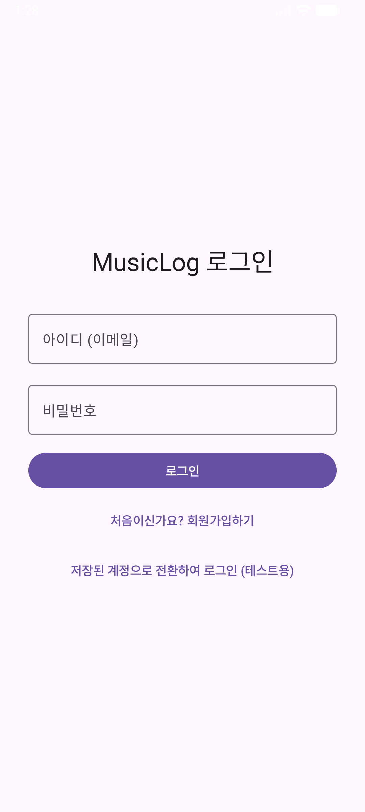
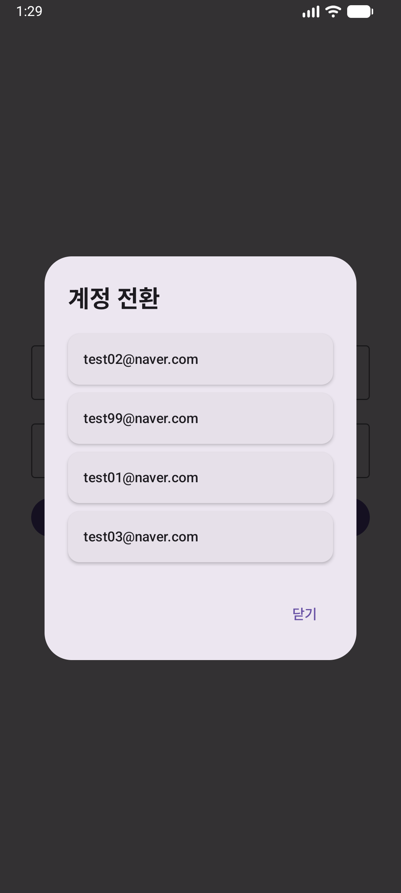
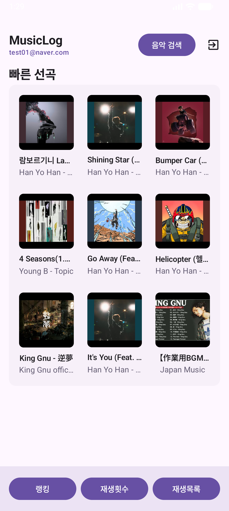
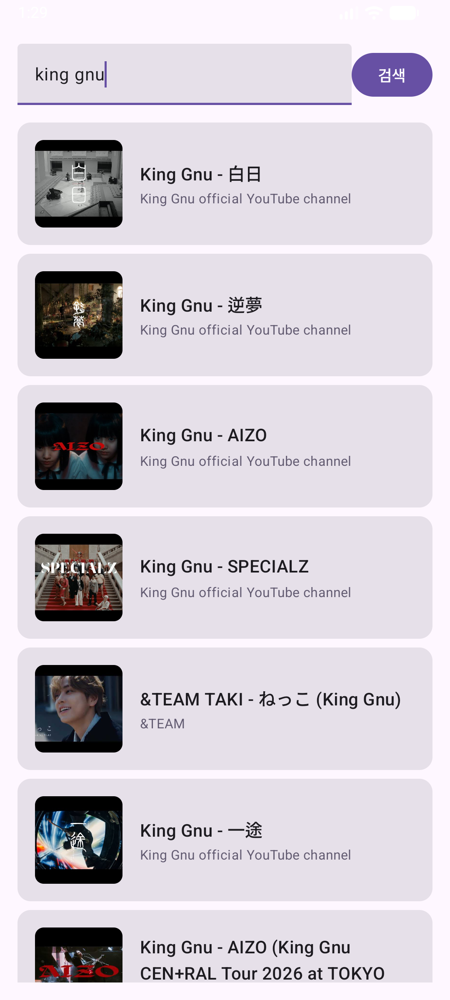
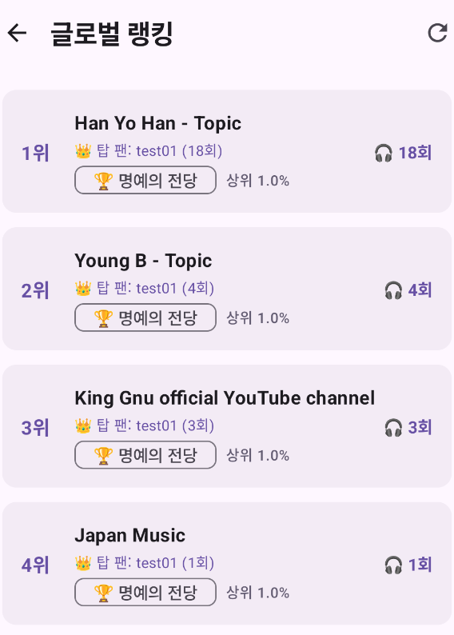

# 🎵 MusicLog (뮤직로그)

## 1. 앱 소개
- 개요: YouTube Data API v3 및 Firebase 기반의 오디오 로깅 및 글로벌 아티스트 랭킹 공유 서비스 
- 타깃 사용자: 누적 음악 청취 데이터를 자산화하고 타인과 취향을 공유하려는 유튜브 플랫폼 이용자
- 기획 의도:
    1. 유튜브 뮤직의 단편적인 기간별 집계를 넘어선 장기 누적 재생 카운트 추적 인프라 제공
    2. 플랫폼 제약으로 불가능했던 개별 곡 단위의 앨범 커버 커스터마이징 기능 구현

---

## 2. 주요 기능 설명
- 실시간 음원 검색 및 대기열 제어: 유튜브 Data API v3 기반 실시간 쿼리 및 인메모리 대기열 버퍼링을 통한 내부 인덱스 제어, 하단 미니 플레이어 클릭 시 대기열 상세 팝업 다이얼로그 노출 (HTML 엔티티 특수문자 디코딩 처리 완료)
- Room DB 영속성 로깅: 청취 시 로컬 DB에 Upsert 트랜잭션을 실행하여 누적 재생 횟수(`playCount`) 및 타임스탬프 영구 보존, 사용자가 선택한 로컬 이미지 URI 기반 앨범 아트 교체 바인딩
- 자가 치유(Self-Healing)형 글로벌 랭킹: 단일 진실 공급원(SSOT) 구조를 통해 오프라인 기록을 자동 정합성 교정, Firebase RTDB 기반 전역 집계 및 백분율 분포 함수 등급 부여, 동점자 발생 시 공동 탑 팬 분기 처리 UI 구현

### 📸 기능 실행 화면
|              로그인              | 계정 전환                               |            메인 대시보드             |            음원 검색             |             글로벌 랭킹             |          대기열 팝업           |
|:-----------------------------:|-------------------------------------|:------------------------------:|:----------------------------:|:------------------------------:|:-------------------------:|
|  |  |  |  |  |  |

---

## 3. 기술 스택
- Core Framework: Kotlin, Jetpack Compose, Coroutines & Flow / StateFlow, Dagger Hilt, Compose Navigation 
- Data Infrastructure: Room Database, YouTube Data API v3, Firebase (Authentication, Realtime Database, Cloud Firestore), Coil

---

## 4. 자료 및 영상 링크
* **2분 요약 영상 링크:** [유튜브 요약 영상 바로가기](https://youtube.com/...)
* **10분 상세 발표 영상 링크:** [유튜브 상세 발표 바로가기](https://youtube.com/...)
* **프로젝트 최종 보고서 파일 링크:** [최종 보고서 PDF 다운로드 (구글 드라이브)](https://drive.google.com/...)
* **APK 파일 다운로드 링크 또는 설치용 QR 코드:** [MusicLog APK 파일 다운로드](https://drive.google.com/...)